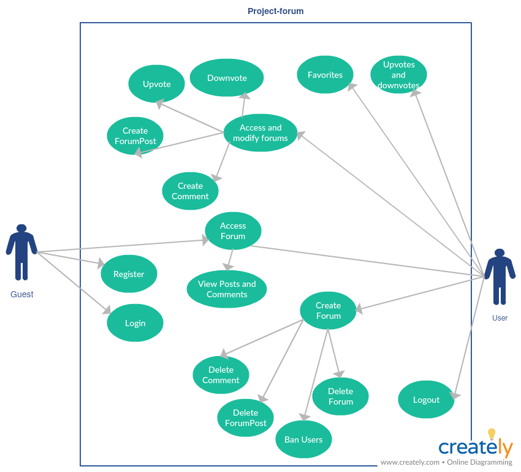
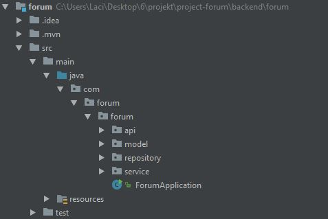
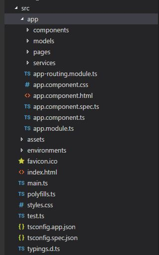

Projekt eszközök
## Team
- Bulatovic László
- Vass Zsigmond Ádám
- Velkei Bence
- Veress Marcell

# project-forum documentation

## How to build and run:
- Download and install the followings:
     - Node 8.X.X version
     - Angular4 (commandline install: npm install -g @angular/cli)
     - You'll require atleast java version 1.8
     - The newest version of git.
     - Download maven and put it into PATH variable
- Clone project from the repository:
     - git clone https://github.com/lacee666/project-forum.git
- Deploy:
     - frontend: Run the command "npm start" at project-forum/frontend/forum (it will run on port 4200)
     - backend: Run the command "mvn spring-boot:run" at project-forum/backend/forum (it will run on port 8080)
     - Open the webpage in a browser at: localhost:4200

## Functional requirements:
Project-forum is a website for all kinds of good purpose forumtypes. We do not condone any hate, crime or or malicious activities. The forum provides a good place to share your thoughts with anyone around the world. All guests can register on the website and become users who can then create subforums, forumposts and comments.

## Non-Functional requirements:
The website has to be secure, no information can be given out to third parties and cannot sell any user data. The website protects the users data and only the user can access it. The forum also has to be accessible all around the world and users who have some kind of disabilities should read the website with ease. 
Use Case diagram:

### Roles:
     - Guest: guests can register, login and access the forums, forumposts and comments.
     - User: users can logout, create forum where they can delete comments, delete forumposts, ban users and delete the forum. They can  access the forumpages too and create forumposts, comments, upvote and downvote. They can also have favorites and can see their  upvotes and downvotes.

## Endpoints
- GET Index page: /index or /
- GET Profile page: /profile
- GET User page: /user/{id}
- GET Forum page: /forum/{forumName}
- GET Forumpost page: /forum/{forumName}/{id}
- POST registration: /registration
- GET login: /login
- Get all forums: /all

### Backend
- Registration: /registration
Tables:

## Directory structure:

## Extra tools used for build
1. SonarQube:
- Setup:
     - Download the newest (non-beta) version of SonarQube and include it in the system variables path: {sonarqupe-dir}/sonarqube-{version}/bin/{os-version}
     - At the last line of "{sonarqube-dir}/conf/sonar.properties" insert the following:
          sonar.projetKey = forum
          sonar.projectName = forum
          sonar.projectVersion = 1.0
          sonar.sources = ForumApplication.java file directory (.../forum/src/main/java/com/forum/forum)
     - Run SonarQube at bin/{os-version}/StartSonar.bat (it will be running on port 9000)
     - Run the command "mvn sonar:sonar" at backend/forum directory
     - Open localhost:9090 in a browser and use can now use it.
2. google-java-formatter
- Setup   
     - In IntelliJ do the following: File -> Setting -> Plugin -> Browse repositories. Search for google-java formatter and install it. Restart the IDE and now you can reformat code by pressing CTRL+ALT+L

-----------------------------------------
Tutorialok:
alkfejl tuts(frontend and backend):
https://github.com/godzsa/issue-tracker
https://github.com/horvathgyozo/alkfejl-2017

Frontend tuts:
docs
https://angular.io/docs
GET POST
https://www.youtube.com/watch?v=L7xPwhwbcHE
great tutorial series
https://www.youtube.com/watch?v=3F7D03NFmew&list=PLlRapu2ErjJ-wF76YOEPPmfsXkX1Jioup
authguard
https://www.youtube.com/watch?v=0Qsg8fyKwO4

Backend tuts:
spring website, setup
https://spring.io/guides/gs/spring-boot/
nutriometer beadandó
https://github.com/lacee666/nutriometer/tree/master/backend
spring boot setup
https://www.callicoder.com/spring-boot-mongodb-angular-js-rest-api-tutorial/
indian tutorial
https://www.youtube.com/watch?v=msXL2oDexqw&list=PLmbC-xnvykcghOSOJ1ZF6ja3aOgZAgaMO&index=1

Program felépítése:
Frontend
Kinézet
asd.jpg
-	Bal oldalt legyen egy nyitható/csukható ablak, ami csak akkor használható ha be vagyunk jelentkezve. Ez tartalmazza a következő alpontokat:
profil – adatok, felhasználónév, email, jelszóváltoztatás
my forums – a felhasználó által létrehozott alfórumok kilistázása, hivatkozással a fórumbejegyzésre
my comments – felhasználó kommentjei listázva, hivatkozással a fórumbejegyzésre
my threads - a felhasználó által létrehozott fórumposztok kilistázása, hivatkozással a fórumbejegyzésre
my upvotes – upvoteolt posztok - || -
my downvotes – downvoteolt posztok - || -
subscribed forums – feliratkozott fórumok listázása
-	középen felül 1 kereső, ahol fórumokat tudunk keresni, ha fórumban vagyunk, akkor pedig fórumposztokra tudunk keresni. listázni lehet a következőképpen: most upvotes, most downvotes, most viewed...
-	középen alul pedig a kilistázott elemek látszódnak. Minden elem így néz ki: egy opcionális kép a bal oldalon, fórum címe, fórum leírása. Ha a kilistázott elem fórumposzt, az is lehet hasonló, majd eldől fejlesztés közben
-	jobb oldalt felül lehet bejelentkezni és regisztrálni. Ha be vagyunk jelentkezve, akkor ezek az elem ne jelenjenek meg. Bejelentkezés szimpla username és password mezők, legyenek ellenőrizve (max 16 karakter mind2). Regisztráció mezőnél kérjük az email-t is, valamilyen regexet használjunk ellenőrzésképpen.
-	jobb oldalt ezek alatt elemek pl új felhasználók, új fórumok, új fórumposztok...
-	lehetnek valami widgetek is alatta, majd meglátjuk.
-	Fórumposzt: A fórumposztnak van címe, leírása, up és downvoteolási lehetőségei, és kommentjei. A kommenteknek is lehetnek kommentjei.
Megjelenítjük, hogy ki írta ezeket a kommenteket, fórumposztokat, és megtekinthetjük. 
Végpontok
Főoldal : /index
profil: /profil
userek: /users/{username}
fórumok: /f/{forumName}
fórumposzt: /f/{forumName}/{id}

Backend
Táblák(nem végleges):
http://dbdesigner.net/designer/schema/151504
User - felhasználót regisztrációkor hozunk létre. Frontendről jön az adat a következő GET végpontra: "/users". 16 karakter lehet a felhasználónév és a jelszó is,
email pedig 1 regexnek feleljen meg. Ha nincs ilyen nevezetű/emailű felhasználó, akkor mentsük el az adatbázisba.
     - Felhasználó megtekintése a következő GET végpontról: "users/{username}". Ilyenkor visszaadjuk a username, upvotes, downvotes, registrationDate mezőket a megfelelő felhasználótól.
     - "/profil" visszaadja a jelenlegi felhasználónak az adatait, a tábla összes elemét.
     - "/f" visszaadjuk az összes fórumot
     - "/f/{forumName}" visszaadjuk a forumName-hez tartozó posztokat
     - "/f/{forumName}/{id}" visszaadjuk az adott fórumhoz az id fórumposztot kommentekkel
